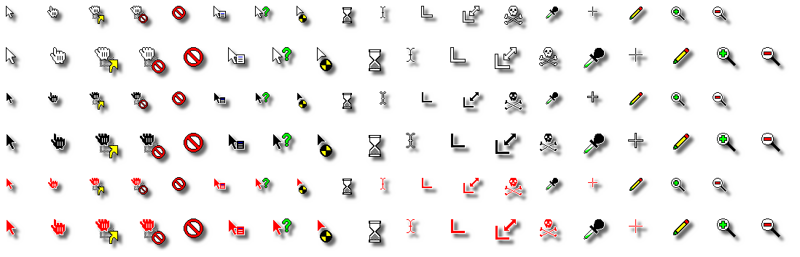

#                          retrosmart-xcursor

<https://github.com/phillbush/retrosmart-xcursor>

Forked from <https://github.com/mdomlop/retrosmart-x11-cursors>

Retrosmart is an X11 cursor theme created [and expanded] for personal use.
Inspired by old Windows 3.x and OS X cursors, Retrosmart brings an old
school feel to your wobbly-windowed desktop of today.

It is available in white or black version, with or without alpha shading.

This fork differs from the original as follows:
* There are no black/white-only themes, all themes have colored details.
* A new red theme is included.
* New cursors for drag-and-drop operations (ask, copy, link, move, no-drop).
* All drag-and-drop cursors are based on the closedhand cursor,
  the dnd cursors originally based on the regular arrow are linked to
  the closedhand-based ones.
* The closedhand cursors and cursors based on it have white and black
  versions (they were originally white only).
* New {ul,ur,ll,lr}_angle cursors.
* New {top,bottom,left,right}_tee cursors.

Run `make retrosmart-xcursor-white-shadow` to build the white-shadowed
theme; or `make all` to build all themes.
`Imagemagick(1)` and `xcursorgen(1)` are needed for building

	make all        # or "make retrosmart-xcursor-black" etc

To install, copy the directory `./retrosmart-xcursor*` for the theme you
want into your icon path (eg' `~/.icons/` or `/usr/local/share/icons/`).

	cp -R retrosmart-xcursor* ~/.icons/

This fork's building process differs from the original as follows:
* Portable makefile, does not depend on GNU Make anymore (at the cost of
  a messier .src/ directory after built).
* Do not generate a new set of XPM for each theme; rather generate PNGs
  directly from source XPMs, or from already generated PNGs (see below).
* Do not convert XPMs into PNGs while shadowing them for the shadow themes;
  rather shadow already converted unshadowed PNGs.
* Distro-specific packaging makefiles have been removed.

Authors:
* Manuel Domínguez López `<mdomlop at google mail dot com>`
* Lucas de Sena `<lucas at seninha dot org>`
